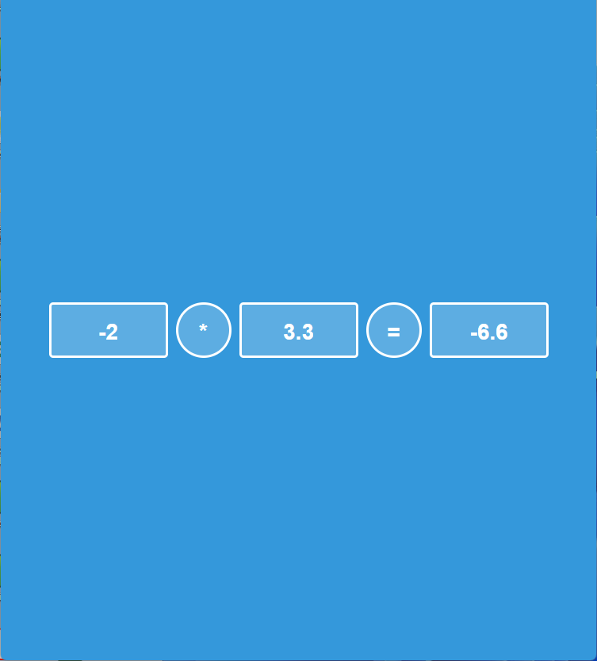

# Kalkulator

Prosty kalkulator podstawowych operacji arytmetycznych na dwóch liczbach rzeczywistych. Uzyte technologie HTML, CSS, JavaScript.

## Działanie

Użytkownik podaje dane z klawiatury, skrypt w pierwszej kolejności wypełnia pierwszy element liczba oraz znakiem kropki.

W każdej liczbie może występować tylko jedne przecinek.

Liczby wprowadzane przez użytkwonika mogą mieć maksymalnie 8 znaków.

Dla budowania liczb dozwolone jest użycie znaków: `1`, `2`, `3`, `4`, `5`, `6`, `7`, `8`, `9`, `0`, `.`, `,`, `-`.

Obsługiwane operatory arytmetyczne: `+`, `-`, `*`, `/`.

Wypełnione pole jest blokowane i nie można w nim dokonać zmiany.

