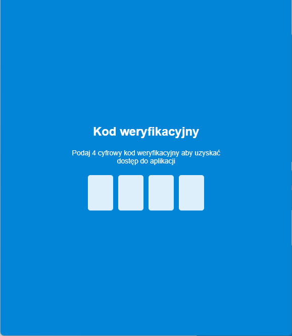
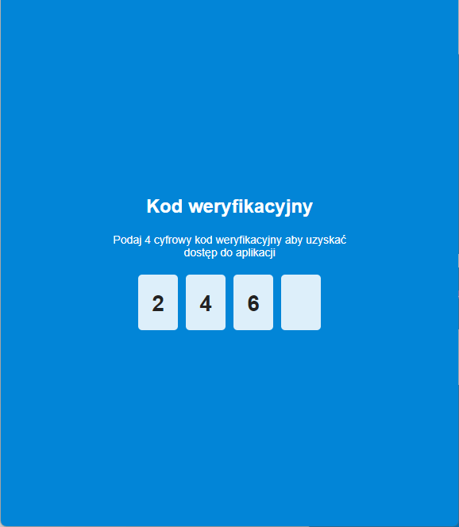
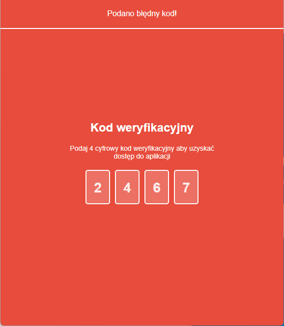
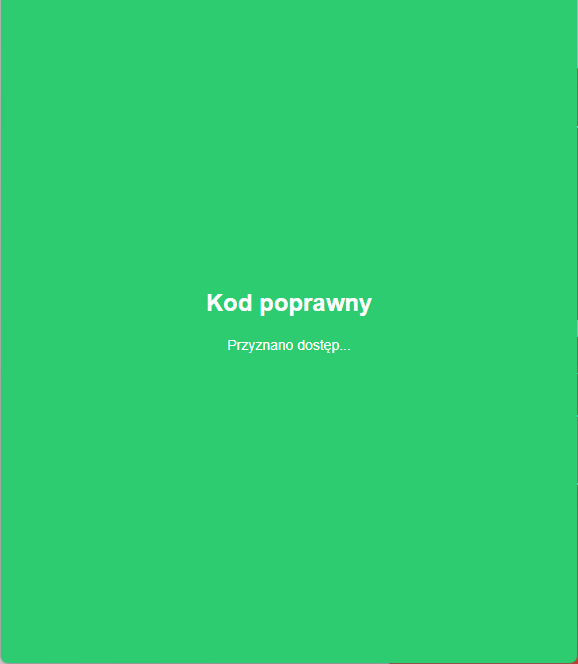

# Kod weryfikacyjny

Przykład prostej aplikacji sprawdzającej kod weryfikacyjny. Apliakacja jest wykonana w technologiach HTML, CSS oraz JavaScript.

## Działanie

Aplikacja pozwala na wprowadzenie cztero cyfrowego kodu klawiszami `1`, `2`, `3`, `4`, `5`, `6`, `7`, `8`, `9`, `0`.

Klawisz `Backspace` usuwa ostatni numer z kodu.

Użytkownik nie może podać więcej znaków niż 4, w razie próby podania większej ilości znaków nie zostaną one dodane do kodu.

Jeżeli zostaną podane 4 cyfry, a kod nie będzie poprawny to kolor ekranu zmieni się na czerwony, a z góry ekranu wysunie się belka z komunikatem o podaniu błędnego kodu.

Jeżeli zostanie podany poprawny kod tło aplikacji zmieni się na kolor zielony, możliwość zmiany kodu zostanie zablokowana, a na środku ekranu rozwinie się ekran z komunikatem o przydzieleniu dostępu.

Poprawny kod jest zdefiniowany w kodzie JavaScript na sztywno w linijce 2:

```js
var correct_code = '2468';
```

## Aplikacja po uruchomieniu



## Aplikacja podczas wpisywania kodu



## Podany błędny kod



## Podano poprawny kod


